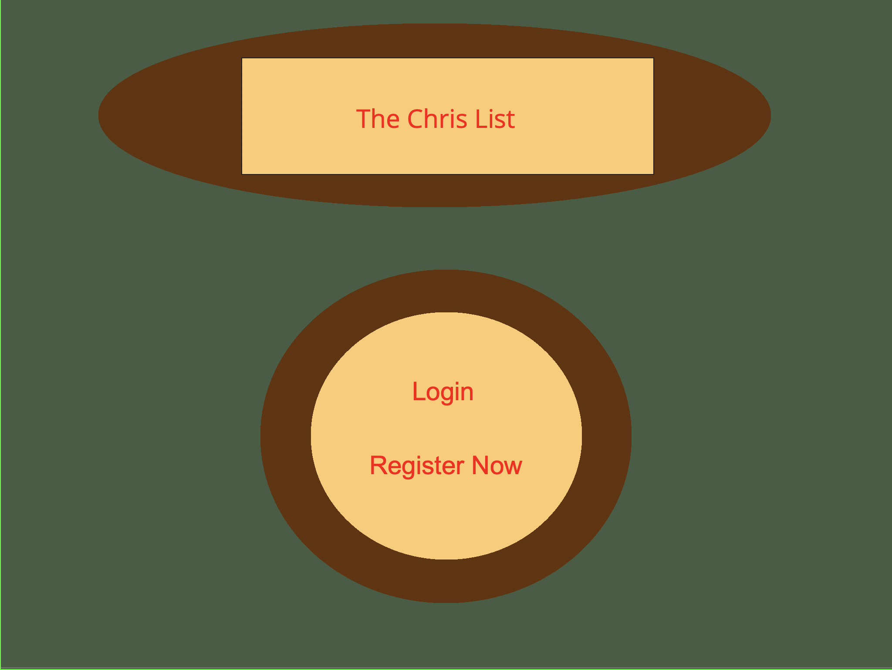
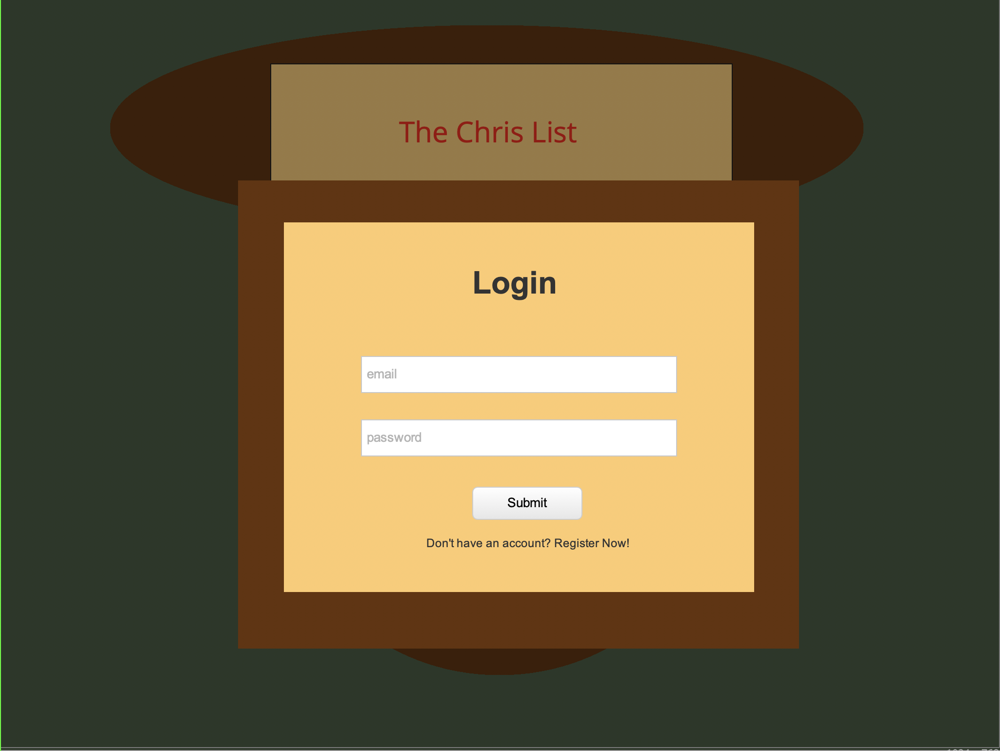
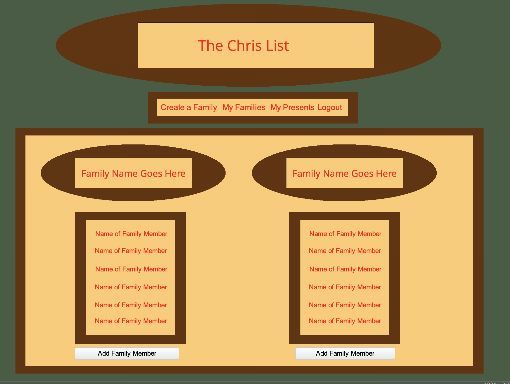
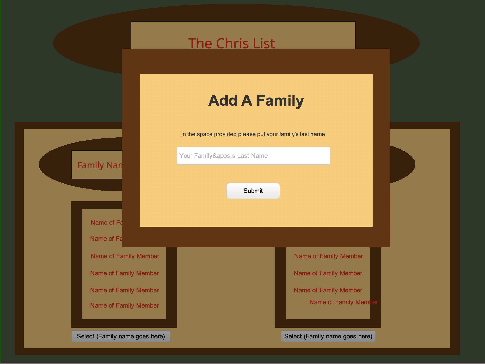
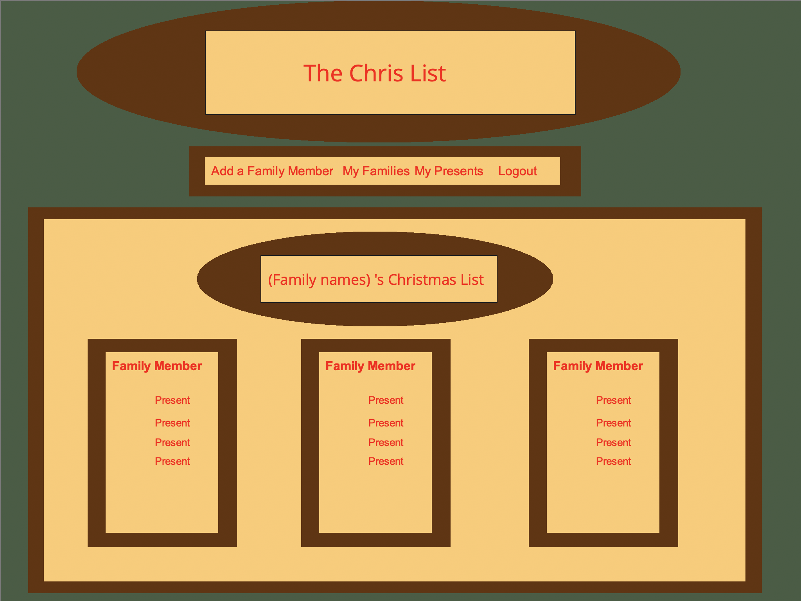
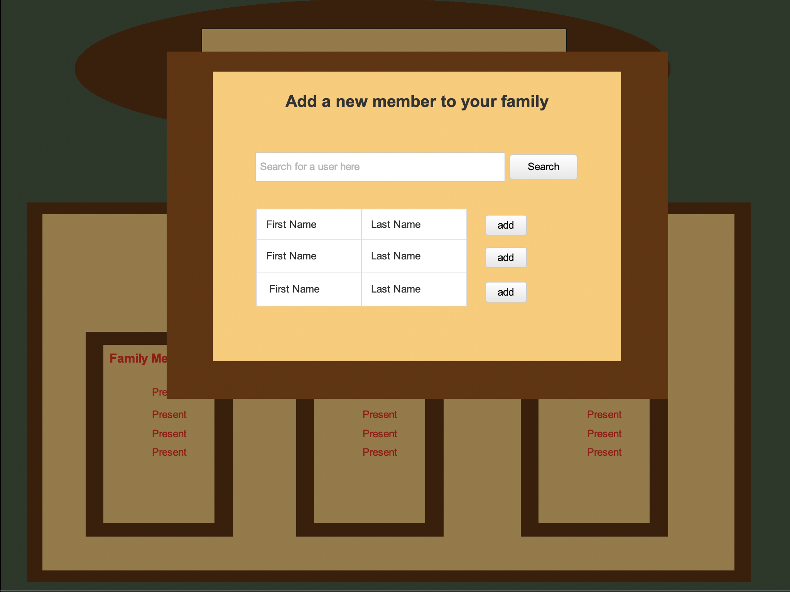
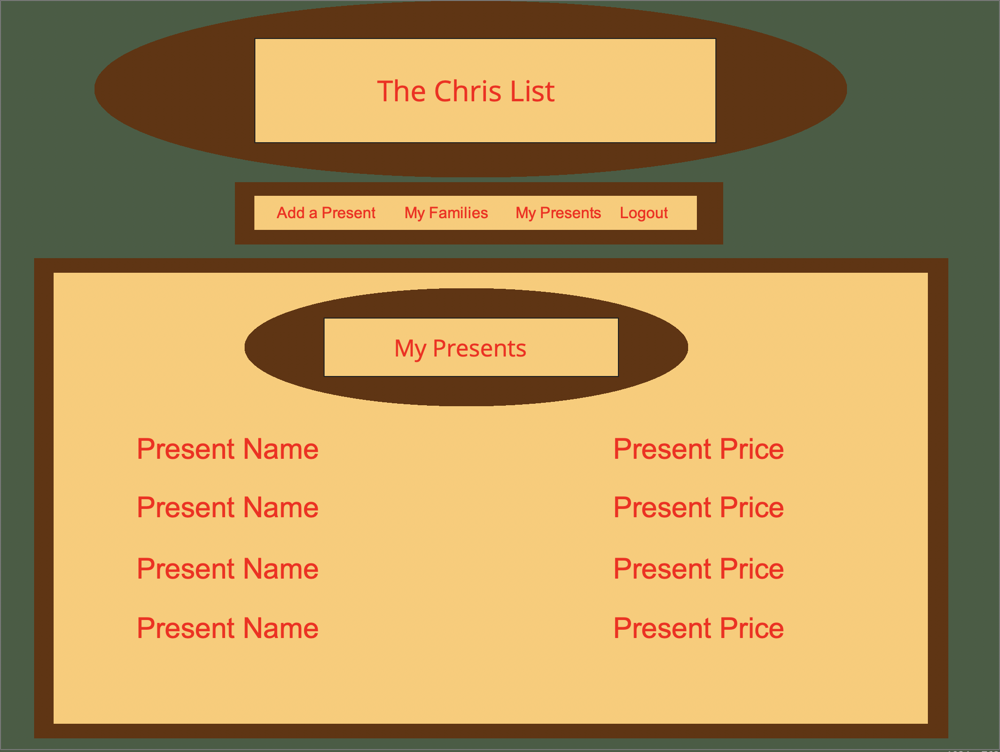
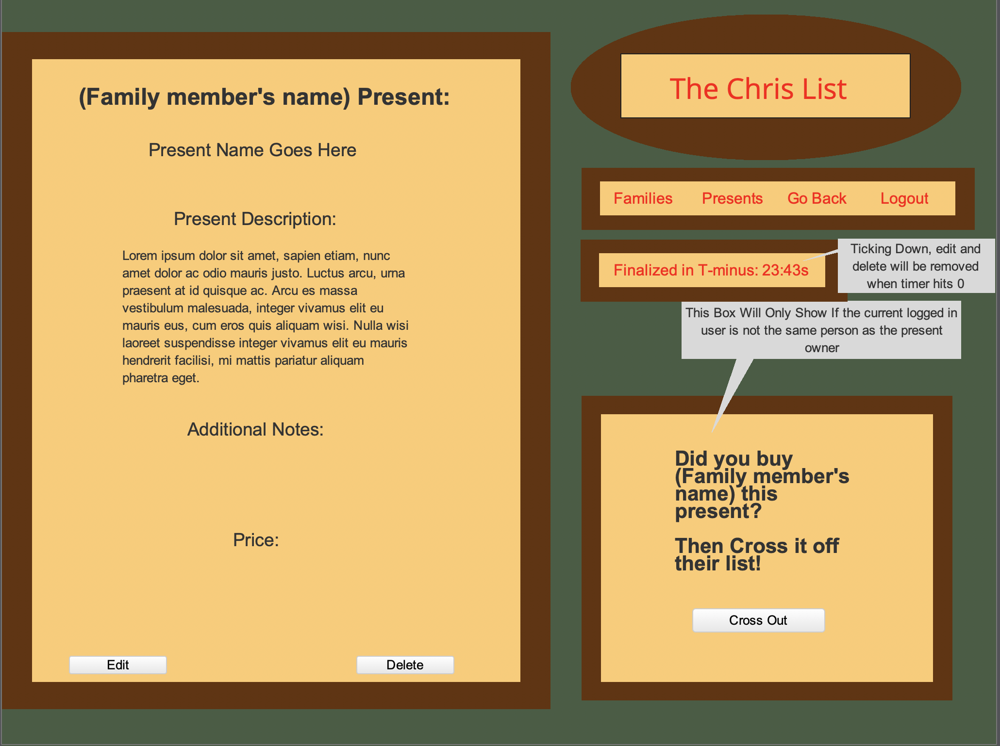
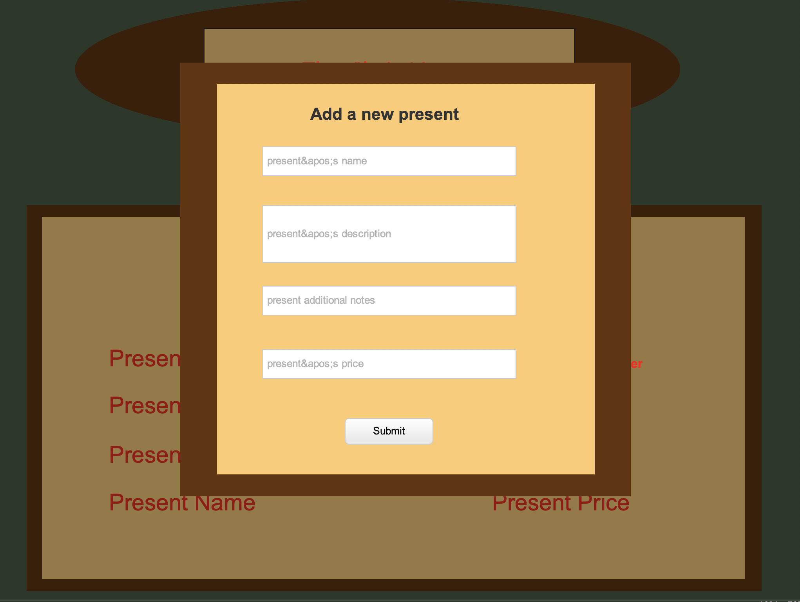

# ChrisList-flask
# User Stories

#Capstone Project - The Chris List Application

#MVP
	
	- Users can Log in or Register

	- Users can see lists of all the families they are connected to

	- Users can create a family and add members to it

	- All users in a family can see the presents of all their family members

	- All Users can add presents to their "my presents" list.

	- Presents will be fully CRUDable

	- Users can cross out other users presents

	- Users who own presents can't see if some other user crosses out one of their present.

#Stretch Goals

	- Admin user can delete other users from a family

	- Users can delete the families they created.

	- Search Bar that searches the internet for presents

	- Interact with a 3rd party api that allows users to buy presents directly through a vendor

# Wire Frame:

 

